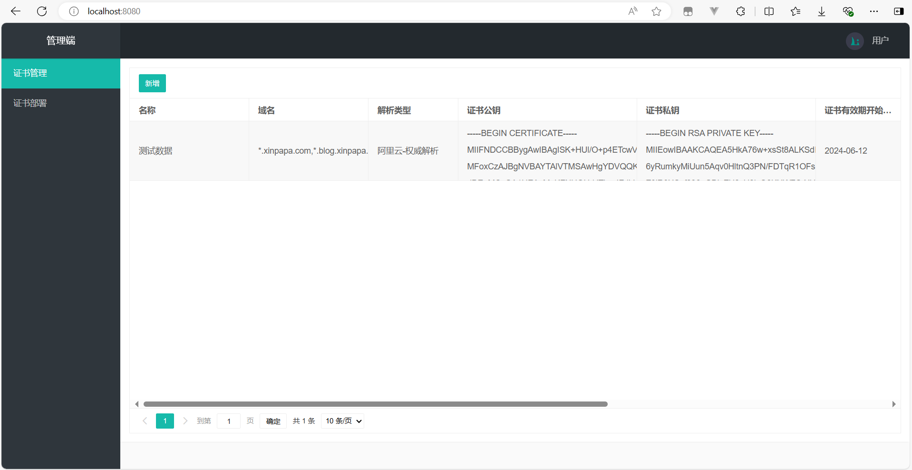
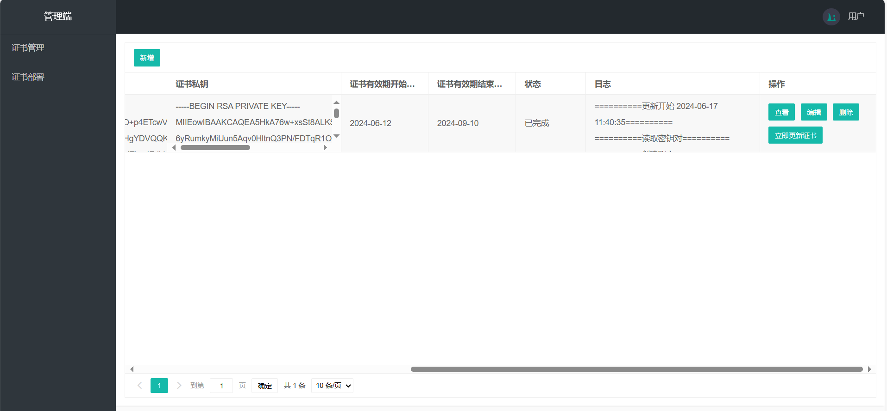
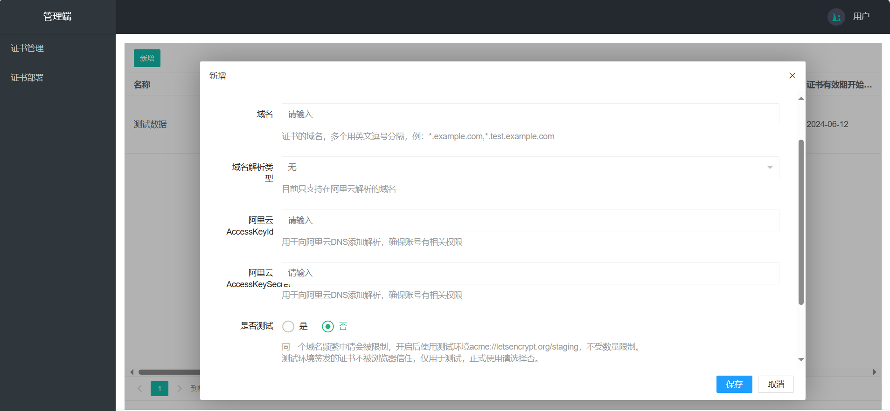

# HTTPS证书管理、证书部署

## 使用场景

* 现有证书在不同的云服务中使用，比如阿里云CDN、阿里云OSS、七牛云CDN等
* 而且云服务账号有多个，每次证书到期后，需要登陆对应的账号手动申请新证书，然后手动部署到各个服务中
* 所以需要一个自动化工具来管理证书，到期自动申请新证书，自动部署到各个服务中。

## 项目说明

* 项目基于Java SpringBoot开发，页面使用Thymeleaf模板引擎、LayUI前端框架
* 证书服务通过acme4j客户端与Let's Encrypt集成，申请免费证书，并通过各家云服务的API或SDK添加DNS解析和部署证书
* 本项目接口未设置鉴权机制，不要部署在公网上，以免敏感信息泄露

## 主要功能

* 证书管理：HTTPS证书到期自动申请新证书（当前只支持在阿里云DNS解析的域名）

* 证书部署（暂未实现）：将证书部署到云服务（阿里云DNS、阿里云OSS等）

## 开发环境

* 开发工具：IntelliJ IDEA
* JDK:17
* Maven:3.8.6
* MySQL:5.7

## 快速开始

* 创建MySQL数据库，名称`ssl`，并执行`doc/mysql/mysql.sql`初始化数据库表
* 修改配置文件`src/main/resources/application.yml`中的`spring.datasource`，配置数据库连接信息
* 运行`Application.java`，浏览器访问`http://localhost:8080`
